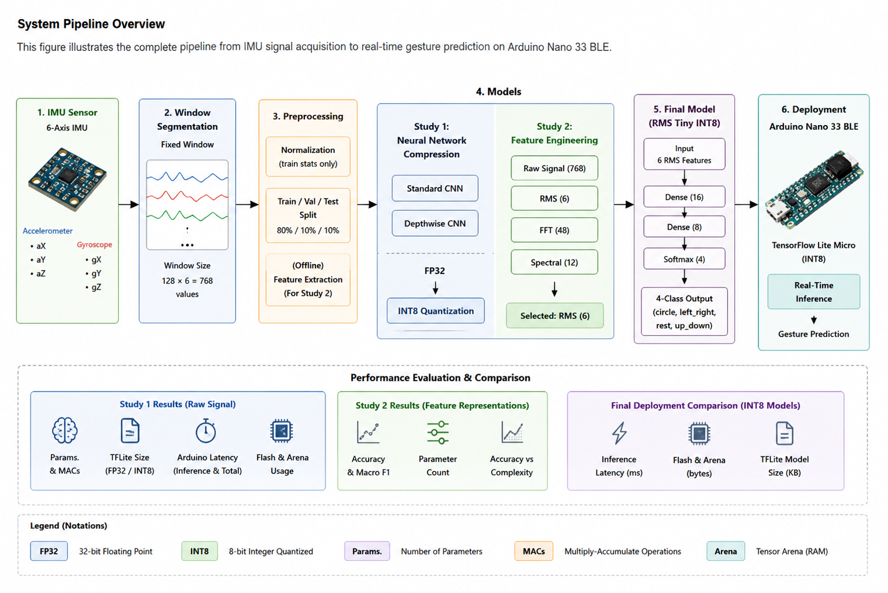
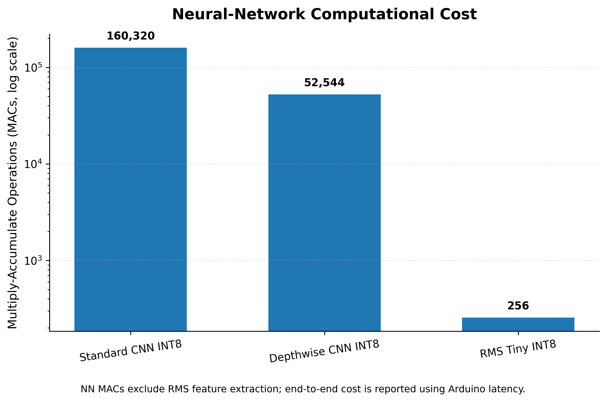
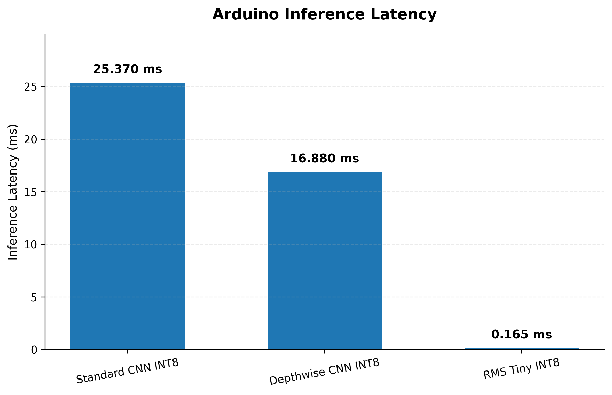
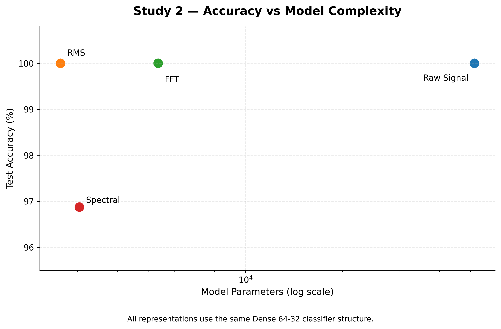
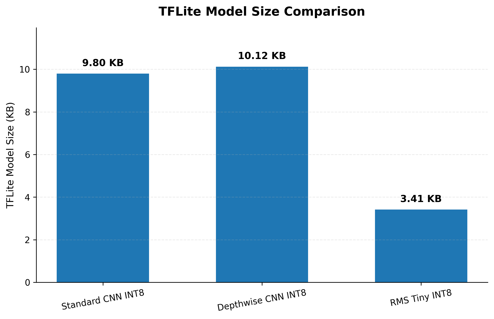

# TinyML Compression Benchmark for IMU Gesture Recognition

## Overview

## System Pipeline Overview

The following diagram summarizes the complete workflow, from
six-axis IMU acquisition and preprocessing to model optimization,
feature engineering, INT8 deployment, and real-time inference on
the Arduino Nano 33 BLE.

<p align="center">
  
</p>

This project investigates efficient TinyML solutions for real-time IMU-based gesture recognition on the Arduino Nano 33 BLE.

The main objective is to reduce computational cost, memory usage, and inference latency while maintaining high classification accuracy.

Two optimization approaches are investigated:

1. Neural network compression:
   - Standard CNN
   - Depthwise CNN
   - INT8 quantization

2. Feature engineering:
   - RMS statistical features
   - Lightweight dense neural network

The final models are deployed and benchmarked on a real embedded platform using TensorFlow Lite Micro.

## System Pipeline

```text
6-Axis IMU Sensor
        |
        v
Window Segmentation
(128 × 6 samples)
        |
        v
Feature Extraction / CNN Processing
        |
        v
INT8 TinyML Model
        |
        v
Arduino Nano 33 BLE
        |
        v
Gesture Prediction
```

## Hardware and Software

### Target Hardware

- Arduino Nano 33 BLE

### Software Framework

- TensorFlow Lite Micro
- TensorFlow Lite INT8 Quantization
- Embedded C/C++ model deployment

### Deployment Goal

The objective is to achieve real-time gesture recognition directly on a microcontroller without cloud processing.

## Dataset and IMU Input

The system uses 6-axis inertial measurement unit (IMU) data.

### Input Channels

| Channel | Signal |
|---|---|
| aX | Accelerometer X-axis |
| aY | Accelerometer Y-axis |
| aZ | Accelerometer Z-axis |
| gX | Gyroscope X-axis |
| gY | Gyroscope Y-axis |
| gZ | Gyroscope Z-axis |


### Window Configuration

Each input sample is segmented into fixed-size windows:

```text
Window size:

128 samples × 6 channels

Total raw input values:

768
```

## Gesture Classification

The system performs four-class gesture recognition.

| Class ID | Gesture |
|---|---|
| 0 | circle |
| 1 | left_right |
| 2 | rest |
| 3 | up_down |


Each gesture class is evaluated during training, validation, and testing.

# Study 1 — Neural Network Compression Benchmark

## Objective

The first study evaluates different neural network architectures for embedded deployment.

The goal is to reduce:

- Model size
- Computational cost
- Memory usage
- Inference latency

while maintaining classification accuracy.

## Compared Architectures

The following models are evaluated:

- Standard CNN
- Depthwise CNN
- INT8 quantized models

## Study 1 Results

### INT8 Model Comparison

All CNN models were converted to TensorFlow Lite INT8 format for embedded deployment.

| Model | Representation | Parameters | NN MACs | TFLite Size |
|---|---|---:|---:|---:|
| Standard CNN INT8 | Raw Signal | 2,660 | 160,320 | 9.797 KB |
| Depthwise CNN INT8 | Raw Signal | 1,330 | 52,544 | 10.125 KB |
| RMS Tiny INT8 | RMS Features | 284 | 256 | 3.414 KB |


The Depthwise CNN reduces the computational cost compared with the Standard CNN while maintaining the same classification performance.

## Neural Network Computational Cost

The neural-network computational cost is measured using Multiply-Accumulate operations (MACs).




The comparison shows that depthwise separable convolutions significantly reduce the number of operations required for inference.

## Embedded Arduino Benchmark

The final INT8 models were evaluated on the Arduino Nano 33 BLE.

### Standard CNN INT8

| Metric | Value |
|---|---:|
| Flash Memory | 194,408 bytes |
| Tensor Arena | 6,644 bytes |
| Inference Time | 25.370 ms |
| Total Processing Time | 26.760 ms |


### Depthwise CNN INT8

| Metric | Value |
|---|---:|
| Flash Memory | 205,424 bytes |
| Tensor Arena | 7,156 bytes |
| Inference Time | 16.880 ms |
| Total Processing Time | 18.330 ms |

## Arduino Inference Latency Comparison



# Study 2 — Feature Engineering Benchmark

## Objective

The second study investigates whether feature extraction can provide a more efficient TinyML solution compared with raw signal processing.

The main research question:

> Can a lightweight feature representation achieve similar accuracy with significantly lower model complexity?


All feature representations use the same classifier architecture:

```text
Input
 |
 v
Dense(64)
 |
 v
Dense(32)
 |
 v
Dense(4)
```

This controlled comparison ensures that differences are mainly caused by the input representation rather than model architecture changes.

## Feature Representation Comparison

Four input representations were evaluated:

| Representation | Input Features | Test Accuracy |
|---|---:|---:|
| Raw Signal | 768 | 100% |
| RMS | 6 | 100% |
| FFT | 48 | 100% |
| Spectral | 12 | 96.875% |


The RMS representation achieves the same classification accuracy as the raw signal while reducing the input dimensionality from 768 values to only 6 features.

## Accuracy vs Model Complexity



The comparison demonstrates that feature engineering can significantly reduce model complexity without sacrificing classification performance.

# Final Selected Model — RMS Tiny INT8

Based on the previous experiments, the RMS representation was selected for the final embedded implementation.

The final model combines:

- RMS feature extraction
- Tiny fully-connected neural network
- INT8 quantization
- TensorFlow Lite Micro deployment

## RMS Tiny INT8 Architecture

```text
6 RMS Features
        |
        v
Dense(16)
        |
        v
Dense(8)
        |
        v
Softmax(4)
```

Model characteristics:

| Metric | Value |
|---|---:|
| Parameters | 284 |
| NN MACs | 256 |
| TFLite Size | 3.414 KB |
| Test Accuracy | 100% |
| Macro F1 | 1.0000 |

## RMS Tiny INT8 Arduino Performance

The final RMS Tiny INT8 model was deployed on the Arduino Nano 33 BLE using TensorFlow Lite Micro.


Measured embedded performance:

| Metric | Value |
|---|---:|
| Arduino Flash | 165,960 bytes |
| Tensor Arena | 948 bytes |
| Neural Network Inference | 0.165 ms |
| Total Processing Time | 0.346 ms |


The complete pipeline includes:

- RMS feature extraction
- Input normalization
- INT8 neural network inference
- Gesture prediction

# Final Embedded Model Comparison

The final deployment comparison includes the three INT8 models evaluated on the Arduino Nano 33 BLE.

| Model | Representation | Parameters | NN MACs | TFLite Size |
|---|---|---:|---:|---:|
| Standard CNN INT8 | Raw Signal | 2,660 | 160,320 | 9.797 KB |
| Depthwise CNN INT8 | Raw Signal | 1,330 | 52,544 | 10.117 KB |
| RMS Tiny INT8 | RMS Features | 284 | 256 | 3.406 KB |


The RMS Tiny INT8 model provides the smallest and most computationally efficient solution.

## Final Deployment Figures


### TFLite Model Size Comparison




### Arduino Inference Latency Comparison


# Deployment Files

# Results and Reproducibility

All quantitative results are provided in the Results folder. These files contain the final benchmark metrics, embedded measurements, and robustness evaluation results.


## TensorFlow Lite Models

```
rms_tiny_model.h
depthwise_cnn_model.h
```

## Input Normalization Parameters

```
rms_feature_scaler.h
depthwise_cnn_scaler.h
```
These C/C++ header files can be directly included in Arduino TensorFlow Lite Micro projects.

## Limitations and Future Work

### Limitations

- The main test set contains only 32 windows, so the reported 100% accuracy should not be interpreted as perfect real-world generalization.
- The dataset currently has limited user and recording diversity.
- Power and energy consumption were not directly measured.

### Future Work

- Collect a larger multi-user and multi-session dataset.
- Perform standardized real-time evaluation for all models.
- Measure power consumption and energy per inference.
- Investigate additional compression methods such as pruning or neural architecture search.

# Conclusion

This project demonstrates that efficient TinyML deployment can be achieved through both neural network optimization and feature engineering.

The final RMS Tiny INT8 model achieves:

- 100% test accuracy
- Only 284 parameters
- Only 256 neural-network MAC operations
- 3.414 KB TFLite model size
- 0.165 ms Arduino inference latency


Compared with larger CNN architectures, RMS Tiny INT8 provides a significantly lighter solution while maintaining the same recognition performance.

This makes it suitable for real-time gesture recognition on resource-constrained microcontrollers.

# Repository Structure

```text
TinyML-Compression-Benchmark/

├── Arduino/
│
├── Code/
│
├── Data/
│
├── Figure/
│
├── Results/
│
├── Presentation/
│
└── README.md
```

## Reproducing the Experiments

1. Clone the repository.
2. Open Code/TinyML_Compression_Benchmark_.ipynb.
3. Install the dependencies from requirements.txt.
4. Run the notebook from top to bottom.
5. Final result tables are exported to Results/.
6. Final deployment headers are available in Arduino/.
