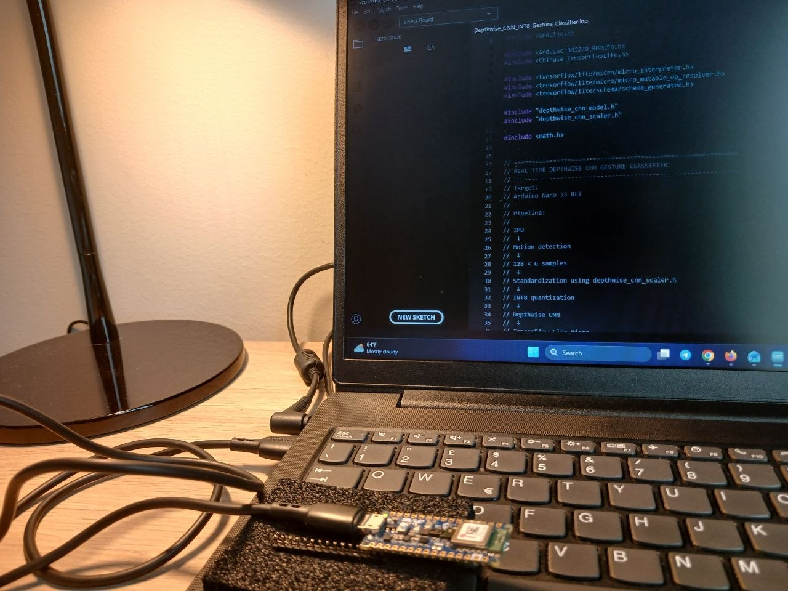
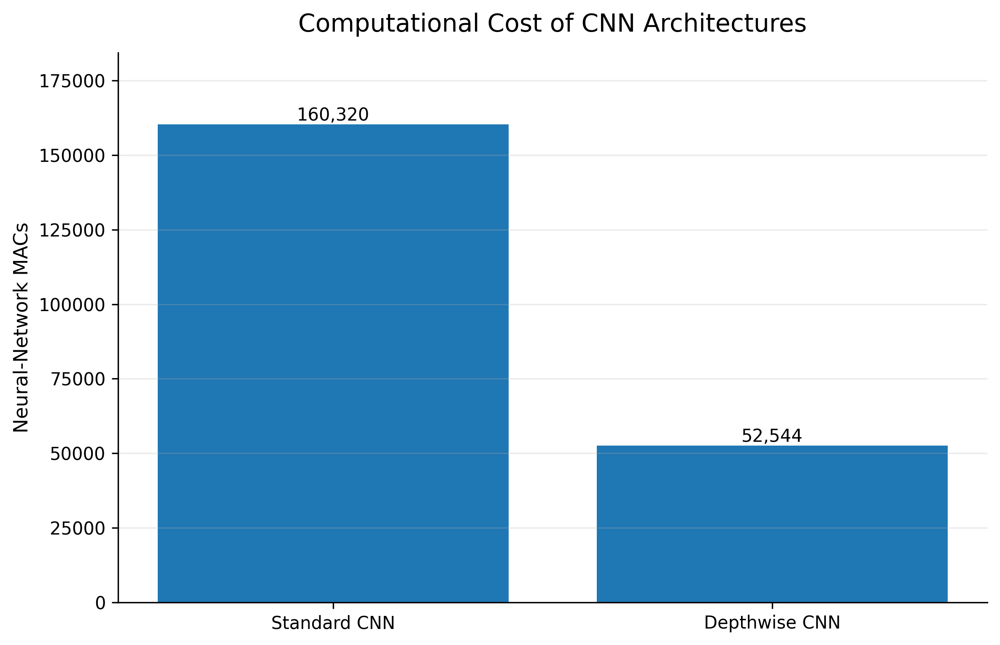

# TinyML Compression Benchmark for IMU Gesture Recognition

## Overview

This project investigates efficient TinyML solutions for real-time
IMU-based gesture recognition on the Arduino Nano 33 BLE.

The main objective is to reduce computational cost, memory usage,
model size, and inference latency while maintaining high
classification accuracy.

Two optimization approaches are investigated:

1. **Neural-network compression**

   * Standard CNN
   * Depthwise CNN
   * INT8 quantization

2. **Feature engineering**

   * Raw signal
   * RMS features
   * FFT features
   * Spectral features
   * Lightweight dense neural networks

The final models are deployed and benchmarked on a physical
Arduino Nano 33 BLE using TensorFlow Lite Micro.

---

## System Pipeline Overview

The following diagram summarizes the complete workflow, from
six-axis IMU acquisition and preprocessing to model optimization,
feature engineering, INT8 deployment, and real-time inference.

<p align="center">
  
</p>

---

## Hardware Setup

The final deployment and latency measurements were performed on a
real Arduino Nano 33 BLE connected to a laptop running the Arduino
IDE and TensorFlow Lite Micro-based inference code.

<p align="center">
  
</p>

This hardware setup was used to validate real embedded inference
rather than only offline notebook results.

---

## System Pipeline

```text
6-Axis IMU Sensor
        |
        v
Window Segmentation
(128 × 6 samples)
        |
        v
Feature Extraction / CNN Processing
        |
        v
INT8 TinyML Model
        |
        v
Arduino Nano 33 BLE
        |
        v
Gesture Prediction
```

---

## Hardware and Software

### Target Hardware

* Arduino Nano 33 BLE

### Software Framework

* TensorFlow
* TensorFlow Lite
* TensorFlow Lite Micro
* INT8 post-training quantization
* Embedded C/C++ deployment

### Deployment Goal

The objective is to perform real-time gesture recognition directly
on a resource-constrained microcontroller without cloud processing.

---

## Dataset and IMU Input

The system uses six-axis inertial measurement unit (IMU) data.

### Input Channels

| Channel | Signal               |
| ------- | -------------------- |
| aX      | Accelerometer X-axis |
| aY      | Accelerometer Y-axis |
| aZ      | Accelerometer Z-axis |
| gX      | Gyroscope X-axis     |
| gY      | Gyroscope Y-axis     |
| gZ      | Gyroscope Z-axis     |

### Window Configuration

Each input window contains:

```text
128 samples × 6 channels = 768 raw input values
```

The complete dataset contains:

```text
320 windows
80 windows per gesture class
4 gesture classes
```

---

## Gesture Classification

The system performs four-class gesture recognition.

| Class ID | Gesture    |
| -------- | ---------- |
| 0        | circle     |
| 1        | left_right |
| 2        | rest       |
| 3        | up_down    |

---

# Study 1 — Neural Network Compression Benchmark

## Objective

The first study investigates whether CNN architecture optimization
and INT8 quantization can reduce embedded computational cost while
maintaining classification performance.

## Compared Architectures

* Standard CNN
* Depthwise CNN
* FP32 and INT8 deployment formats

## Study 1 Results

| Model              | Parameters | NN MACs | TFLite Size | Test Accuracy |
| ------------------ | ---------: | ------: | ----------: | ------------: |
| Standard CNN FP32  |      2,660 | 160,320 |   15.121 KB |          100% |
| Standard CNN INT8  |      2,660 | 160,320 |    9.797 KB |          100% |
| Depthwise CNN FP32 |      1,330 |  52,544 |   10.824 KB |          100% |
| Depthwise CNN INT8 |      1,330 |  52,544 |   10.125 KB |          100% |

The Depthwise CNN reduces the parameter count by approximately
50% and the neural-network MAC count by approximately 67.2%
compared with the Standard CNN.

## Neural Network Computational Cost



## Embedded Arduino Benchmark

### Standard CNN INT8

| Metric                |         Value |
| --------------------- | ------------: |
| Flash Memory          | 194,408 bytes |
| Tensor Arena          |   6,644 bytes |
| Inference Time        |     25.370 ms |
| Total Processing Time |     26.760 ms |

### Depthwise CNN INT8

| Metric                |         Value |
| --------------------- | ------------: |
| Flash Memory          | 205,424 bytes |
| Tensor Arena          |   7,156 bytes |
| Inference Time        |     16.880 ms |
| Total Processing Time |     18.330 ms |

The Depthwise CNN reduces measured inference latency from
25.370 ms to 16.880 ms.

## Arduino Inference Latency Comparison


---

# Study 2 — Feature Engineering Benchmark

## Objective

The second study investigates whether feature extraction can provide
a more efficient TinyML solution than directly processing the raw
IMU window.

The main research question is:

> Can a lightweight feature representation achieve similar accuracy
> with significantly lower model complexity?

All feature representations use the same controlled classifier:

```text
Input
  |
  v
Dense(64)
  |
  v
Dense(32)
  |
  v
Dense(4)
```

This controlled comparison isolates the effect of the input
representation.

## Feature Representation Comparison

| Representation | Input Features | Parameters | Test Accuracy | Macro F1 |
| -------------- | -------------: | ---------: | ------------: | -------: |
| Raw Signal     |            768 |     51,428 |          100% |   1.0000 |
| RMS            |              6 |      2,660 |          100% |   1.0000 |
| FFT            |             48 |      5,348 |          100% |   1.0000 |
| Spectral       |             12 |      3,044 |       96.875% |   0.9686 |

RMS achieves the same test accuracy as the raw and FFT
representations while reducing the input dimensionality from
768 values to only 6 features.

## Accuracy vs Model Complexity


---

# Final Selected Model — RMS Tiny INT8

Based on the controlled feature-engineering study, RMS was selected
for the final lightweight embedded implementation.

The final system combines:

* RMS feature extraction
* Tiny fully-connected neural network
* INT8 quantization
* TensorFlow Lite Micro deployment

## RMS Tiny INT8 Architecture

```text
6 RMS Features
        |
        v
Dense(16)
        |
        v
Dense(8)
        |
        v
Softmax(4)
```

## Final Model Characteristics

| Metric           |    Value |
| ---------------- | -------: |
| Input Features   |        6 |
| Parameters       |      284 |
| NN MACs          |      256 |
| FP32 TFLite Size | 3.227 KB |
| INT8 TFLite Size | 3.414 KB |
| Test Accuracy    |     100% |
| Macro F1         |   1.0000 |

The 256 MAC value refers only to the neural-network classifier and
does not include RMS feature extraction.

## RMS Tiny INT8 Arduino Performance

| Metric                   |         Value |
| ------------------------ | ------------: |
| Arduino Flash            | 165,960 bytes |
| Tensor Arena             |     948 bytes |
| RMS + Preprocessing      |      0.181 ms |
| Neural-Network Inference |      0.165 ms |
| Total Processing Time    |      0.346 ms |

The complete embedded pipeline includes:

* RMS feature extraction
* Input normalization
* INT8 neural-network inference
* Gesture prediction

---

# Final Embedded Model Comparison

The three final INT8 configurations were evaluated on the
Arduino Nano 33 BLE.

| Model              | Representation | Parameters | NN MACs |  TFLite Size | Tensor Arena |    Inference |
| ------------------ | -------------- | ---------: | ------: | -----------: | -----------: | -----------: |
| Standard CNN INT8  | Raw Signal     |      2,660 | 160,320 |     9.797 KB |      6,644 B |    25.370 ms |
| Depthwise CNN INT8 | Raw Signal     |      1,330 |  52,544 |    10.125 KB |      7,156 B |    16.880 ms |
| **RMS Tiny INT8**  | RMS Features   |    **284** | **256** | **3.414 KB** |    **948 B** | **0.165 ms** |

RMS Tiny INT8 provides the lowest computational complexity,
Tensor Arena requirement, model size, and measured inference
latency among the evaluated final models.

## Final Deployment Figures

### TFLite Model Size Comparison


### Arduino Inference Latency Comparison


---

# Deployment Files

Three complete TensorFlow Lite Micro implementations are provided.

```text
Arduino/
├── Standard_CNN_INT8_Gesture_Classifier.ino
├── Depthwise_CNN_INT8_Gesture_Classifier.ino
├── RMS_Tiny_INT8_Gesture_Classifier.ino
│
├── standard_cnn_model.h
├── depthwise_cnn_model.h
├── rms_tiny_model.h
│
├── standard_cnn_scaler.h
├── depthwise_cnn_scaler.h
└── rms_feature_scaler.h
```

The model headers contain the synchronized final TFLite models,
while the scaler headers contain the normalization parameters used
during deployment.

---

# Results

Quantitative experiment outputs are stored in the `Results/`
directory.

Important files include:

```text
Results/
├── final_report_table.csv
├── final_summary.csv
├── robustness_random_vs_blocked.csv
├── study1_offline_host_benchmark.csv
└── final_artifacts.md
```

The final synchronized artifact versions are documented in:

[Results/final_artifacts.md](Results/final_artifacts.md)

---

# Reproducing the Experiments

### 1. Clone the repository

```bash
git clone https://github.com/mrzamaniiii/TinyML-Compression-Benchmark.git
cd TinyML-Compression-Benchmark
```

### 2. Install the dependencies

```bash
pip install -r requirements.txt
```

### 3. Open the main notebook

```text
Code/TinyML_Compression_Benchmark_.ipynb
```

The notebook can be executed in Google Colab or a compatible
Jupyter environment.

### 4. Run the notebook from top to bottom

The notebook reproduces:

* Dataset loading and preprocessing
* Train/validation/test splitting
* Standard CNN training
* Depthwise CNN training
* INT8 quantization
* Raw/RMS/FFT/Spectral feature comparison
* RMS Tiny optimization
* Robustness checks
* MAC and model-size analysis
* Final result tables and figures
* Deployment model exports

The final synchronized run uses:

```text
TensorFlow: 2.20.0
Random seed: 42
```

Normalization statistics are computed using the training set only.

---

# Limitations and Future Work

## Limitations

* The dataset currently has limited user and recording diversity.
* Power and energy consumption were not directly measured.

## Future Work

* Collect a larger multi-user and multi-session dataset.
* Perform standardized real-time evaluation for all models.
* Measure power consumption and energy per inference.
* Investigate additional compression methods such as pruning or
  neural architecture search.

---

# Repository Structure

```text
TinyML-Compression-Benchmark/
│
├── Arduino/
│   └── Arduino deployment code, model headers, and scalers
│
├── Code/
│   └── Main training and evaluation notebook
│
├── Data/
│   └── IMU gesture datasets
│
├── Figure/
│   └── Experimental plots and system diagrams
│
├── Report/
│   └── Technical report
│
├── Results/
│   └── Final benchmark and robustness results
│
├── Presentation/
│   └── Presentation and demo materials
│
├── requirements.txt
└── README.md
```

---

# Conclusion

This project demonstrates that TinyML efficiency can be improved
through both neural-network optimization and feature engineering.

The final RMS Tiny INT8 model achieves 100% accuracy on the current
test set using:

* 284 parameters
* 256 neural-network MAC operations
* 3.414 KB TFLite model size
* 948 bytes Tensor Arena
* 0.165 ms Arduino inference latency
* 0.346 ms total processing time

Compared with the evaluated CNN architectures, RMS Tiny INT8
provides a substantially lighter embedded solution while preserving
classification performance on the current test set.

The project therefore demonstrates the value of combining
lightweight signal processing with compact neural networks for
resource-constrained TinyML applications.
